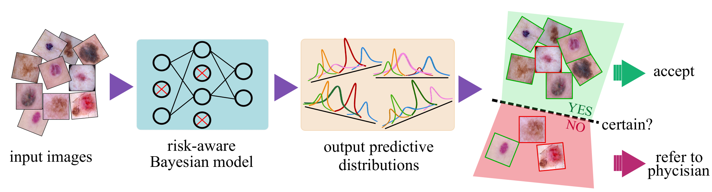

# Skin Lesion Classification and Uncertainty Estimation

This repository includes the TensorFlow implementation of the methods described in our paper 
[Risk-Aware Machine Learning Classifier for Medical Diagnosis](https://www.mdpi.com/2077-0383/8/8/1241).


*Fig1. Processing pipeline of the proposed risk-aware Bayesian model.*


## Demo
A demo of the training and testing with a step-by-step instruction is provided in the
[Skin_Lesion_Analysis.ipynb](https://github.com/hula-ai/skin_lesion_uncertainty_estimation/blob/master/Skin_Lesion_Analysis.ipynb) file.

## Download data and the pretrained model
- Link to get the preprocessed [data](https://www.dropbox.com/sh/8ncoth0u1ifqsm7/AAC2hWaGVi_kUg6B65pX-Pyea/preprocessed_data.h5?dl=0)
- Link to get a [sample pretrained model](https://www.dropbox.com/sh/8ncoth0u1ifqsm7/AABlo_FckiIEfI13Z0RvTgj3a/model_data/lesion_densenet169?dl=0)
. (create a ```save``` folder at .../skin_lesion_uncertainty_estimation/save and paste the 
lesion_densenet169 model inside it).

## Train
- For training with default setup: ```python main.py ```

You can easily train your desired network configuration by passing the desired arguments as provided 
in the ```config.py``` file. For example:

- For training with batch size of 8: ```python main.py --batch_size=8```


## Test

- For testing the pretrained model run: ```python inference.py```

- For testing your trained model run: ```python inference.py --model_name=your_model_name_as_saved```


## Citation
If you found this repo useful, please use this bibtex to cite our paper:
```
@article{mobiny2019risk,
  title={Risk-Aware Machine Learning Classifier for Skin Lesion Diagnosis},
  author={Mobiny, Aryan and Singh, Aditi and Van Nguyen, Hien},
  journal={Journal of clinical medicine},
  volume={8},
  number={8},
  pages={1241},
  year={2019},
  publisher={Multidisciplinary Digital Publishing Institute}
}
```

